<p align="center">
  
  
  
  
  
  
  
  
  
</p>

# Laboratorio RDS, IIS, NPS/RADIUS y AAA Cisco

**Autor:** Michael David Robles Fermín  
**Matrícula:** 2025-0845  
**Asignatura:** Seguridad de Redes  
**Servidor:** Windows Server 2025  
**Dominio:** `michael20250845.local`  
**FQDN RDS/RDWeb/RD Gateway:** `srv-rds-nps.redes.local`  
**Video de Youtube:** `https://youtu.be/Ss2mVlgVoF8`


## Enlaces del laboratorio

- Página IIS personalizada: `http://10.8.45.130/`
- RD Web Access clásico: `https://srv-rds-nps.redes.local/RDWeb/Pages/en-US/login.aspx`
- RD Web Client HTML5: `https://srv-rds-nps.redes.local/RDWeb/webclient/index.html`
- SSH hacia R1: `10.8.45.1`
- Repositorio GitHub: pendiente de publicar.
- Video de demostración: pendiente de publicar.

## Objetivo

El objetivo de este laboratorio es implementar un entorno donde Windows Server 2025 publique una página personalizada de IIS mediante RemoteApp, RD Web Access clásico y RD Web Client HTML5. Además, se configura NPS como servidor RADIUS para que un router Cisco IOSv autentique usuarios por AAA y asigne niveles de privilegio diferentes según grupos de Active Directory.

## Topología y direccionamiento

La topología se diseñó con un router central R1, dos switches y dos redes separadas. Del lado izquierdo se ubica el cliente Kali Linux y del lado derecho el Windows Server 2025. R1 enruta entre ambas redes y también actúa como cliente RADIUS del servidor NPS.

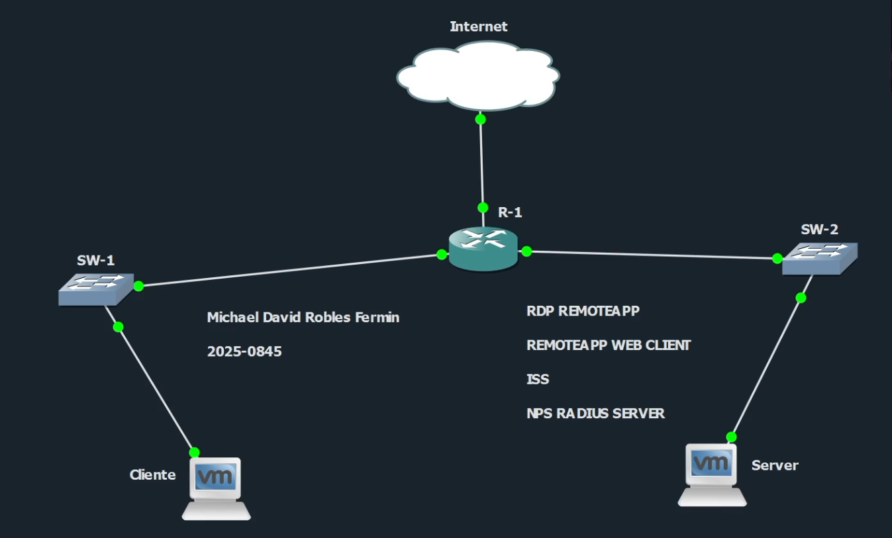

| Dispositivo | Interfaz | Dirección IP | Descripción |
|---|---|---:|---|
| R1 | Gi0/0 | `10.8.45.1/25` | Red cliente hacia SW1/Kali |
| R1 | Gi0/1 | `10.8.45.129/25` | Red servidor hacia SW2/Windows |
| SW1 | VLAN 20 | `10.8.45.2/25` | Administración de SW1 |
| SW2 | VLAN 10 | `10.8.45.131/25` | Administración de SW2 |
| Kali Linux | eth0 | `10.8.45.10/25` | Cliente de pruebas |
| Windows Server | Ethernet0 2 | `10.8.45.130/25` | IIS, RDS, RD Gateway y NPS |

## Servicios configurados

En Windows Server se configuraron Active Directory, DNS, IIS, Remote Desktop Services, RemoteApp, RD Web Access, RD Web Client HTML5, RD Gateway y NPS/RADIUS. En el router se configuró AAA para consultar al servidor NPS mediante RADIUS.

## IIS y página personalizada

IIS funciona como servidor web del laboratorio. La página personalizada identifica el laboratorio de Seguridad de Redes y muestra accesos hacia los servicios RDP publicados.

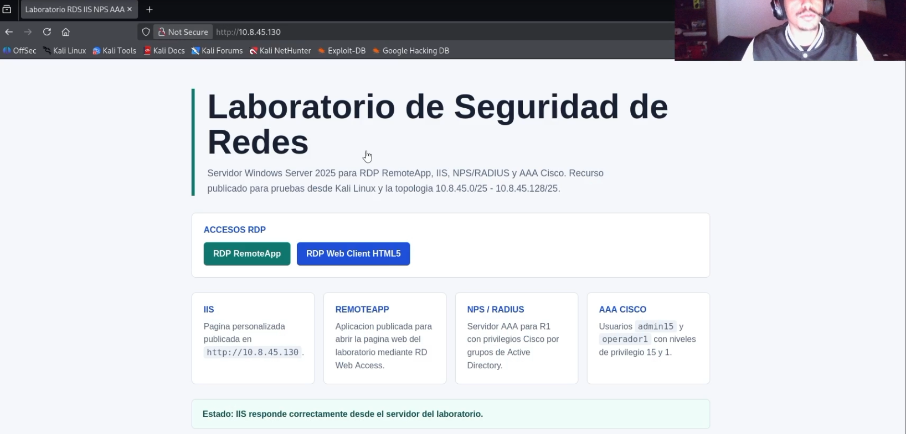

En esta evidencia se observa que la página web personalizada responde correctamente desde el cliente. La página presenta el laboratorio y los accesos hacia RemoteApp y RD Web Client HTML5.

## RD Web Access clásico

RD Web Access clásico es el portal tradicional de Remote Desktop Services. Desde este portal el usuario inicia sesión y visualiza los recursos publicados.

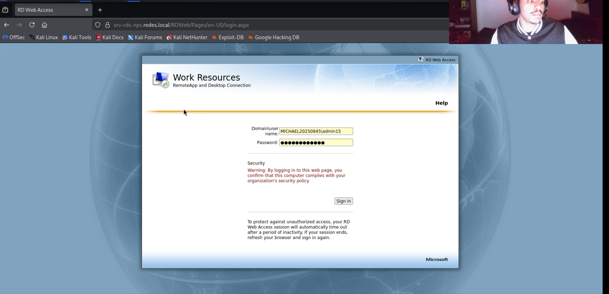

En esta captura se muestra el inicio de sesión al portal clásico usando el usuario `MICHAEL20250845\admin15`. Este usuario pertenece al grupo con acceso permitido a la RemoteApp.

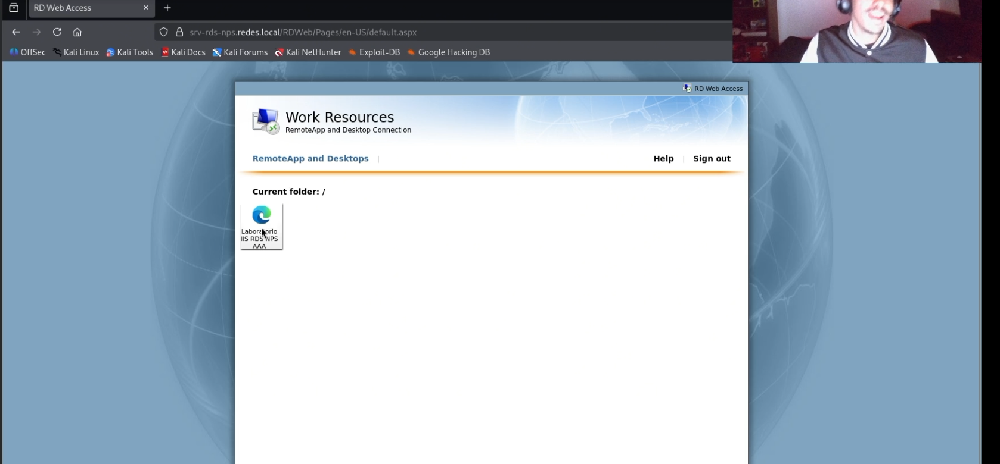

Aquí se observa el recurso **Laboratorio IIS RDS NPS AAA**. Este recurso no es un escritorio completo, sino una RemoteApp que ejecuta Microsoft Edge para abrir la página de IIS.

## Prueba de RemoteApp con xfreerdp3

Desde Kali se utilizó `xfreerdp3` para abrir el archivo `.rdp` generado por RD Web Access clásico.

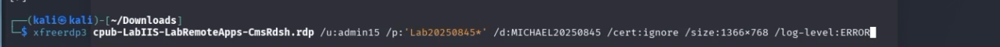

Comando usado:

```bash
xfreerdp3 cpub-LabIIS-LabRemoteApps-CmsRdsh.rdp /u:admin15 /p:'Lab20250845*' /d:MICHAEL20250845 /cert:ignore /size:1366x768 /log-level:ERROR
```

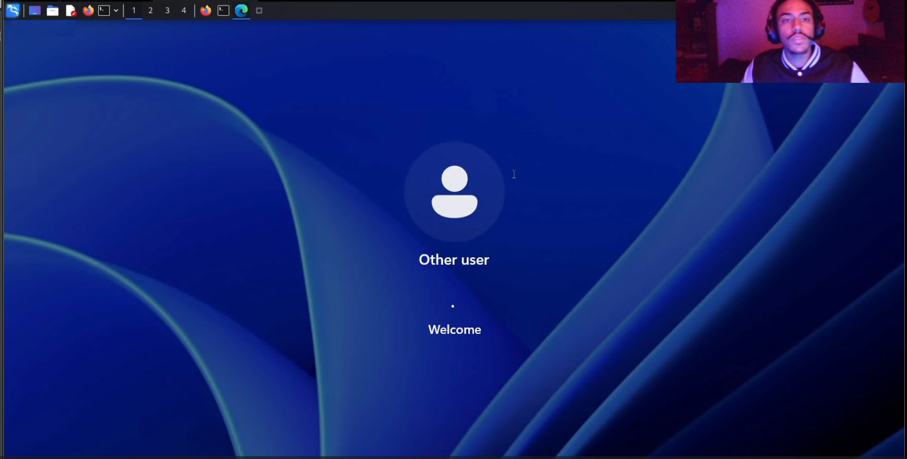

Esta imagen muestra la sesión remota iniciándose. El cliente RDP autentica al usuario y abre el recurso publicado.

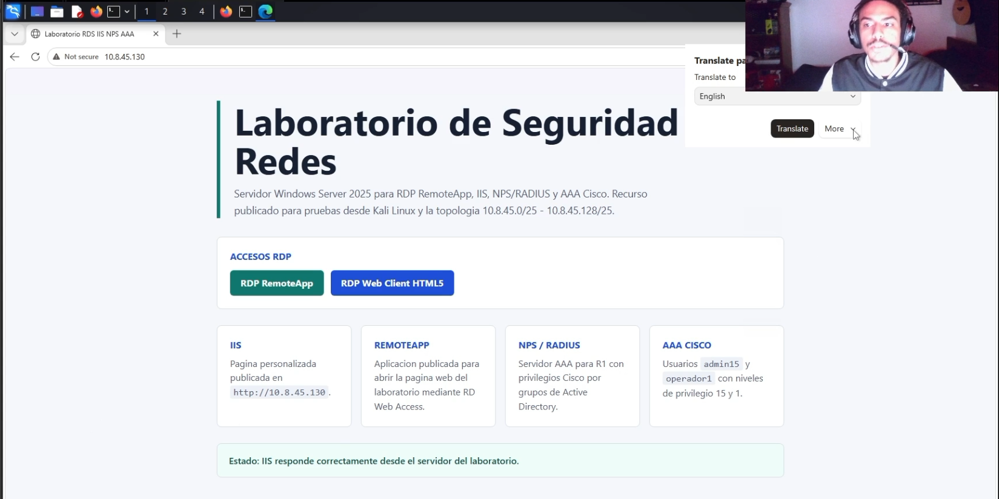

Después de autenticarse, la RemoteApp abre Microsoft Edge y carga la página de IIS del laboratorio. Esto valida que la página fue publicada correctamente mediante RemoteApp.

## RD Web Client HTML5

RD Web Client HTML5 es el cliente moderno de Remote Desktop Services. Permite abrir los recursos publicados directamente desde el navegador, usando RD Gateway y certificados configurados en el servidor.

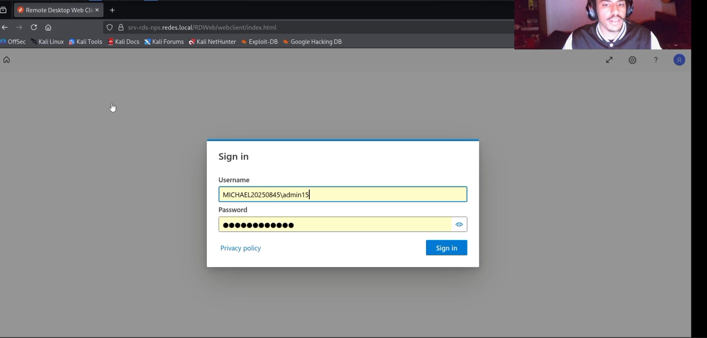

La captura muestra el inicio de sesión en el cliente HTML5 usando el mismo dominio y usuario del laboratorio.

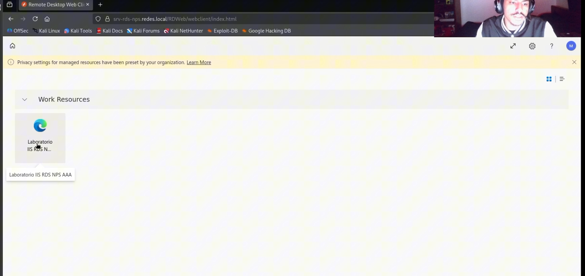

Aquí se observa el recurso disponible dentro del Web Client HTML5. Esto confirma que el feed de RemoteApps se entrega correctamente al usuario.

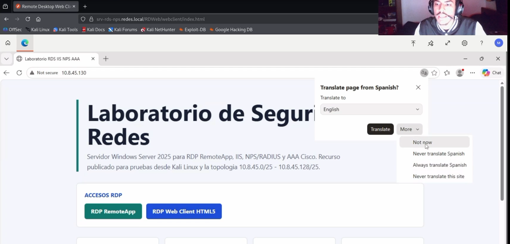

Al abrir el recurso desde el Web Client, el navegador remoto carga directamente la página de IIS. Esta prueba valida el funcionamiento de RD Web Client HTML5 y RD Gateway.

## NPS/RADIUS en Windows Server

NPS funciona como servidor RADIUS. El router R1 fue agregado como cliente RADIUS usando la IP `10.8.45.129`, que corresponde a la interfaz del router del lado del servidor.

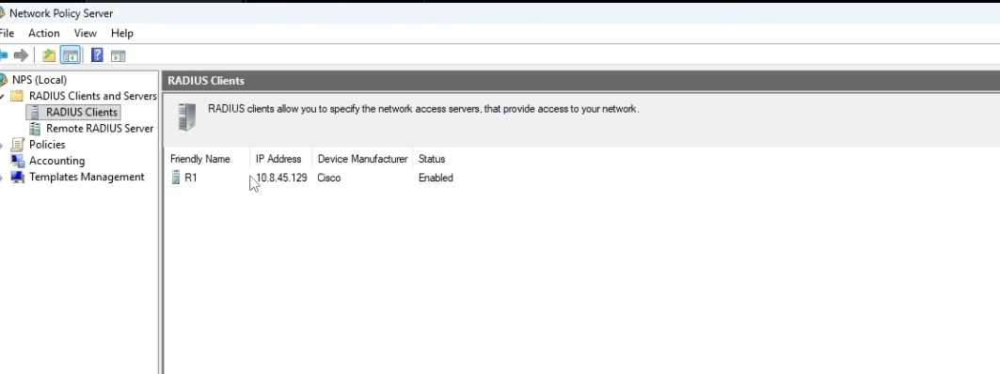

En esta evidencia se observa el cliente RADIUS **R1**, con IP `10.8.45.129`, fabricante Cisco y estado habilitado.

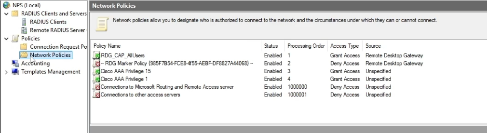

En las políticas de red se observan las reglas **Cisco AAA Privilege 15** y **Cisco AAA Privilege 1**. Estas políticas son las que autorizan distintos niveles de acceso para los usuarios del router.

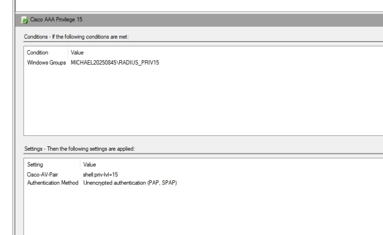

La política de privilegio 15 aplica al grupo `MICHAEL20250845\RADIUS_PRIV15`. En los atributos se entrega `Cisco-AV-Pair` con el valor `shell:priv-lvl=15`, permitiendo acceso administrativo completo.

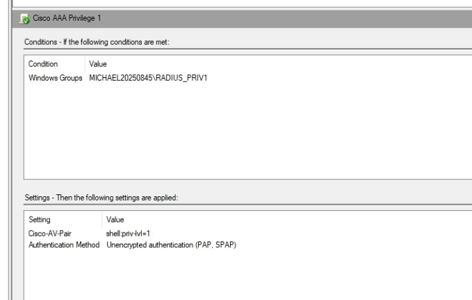

La política de privilegio 1 aplica al grupo `MICHAEL20250845\RADIUS_PRIV1`. En este caso NPS devuelve `shell:priv-lvl=1`, por lo que el usuario entra con permisos básicos.

## AAA/RADIUS en R1

AAA permite separar tres funciones: autenticación, autorización y accounting. En este laboratorio, el router autentica usuarios por RADIUS contra NPS, recibe el nivel de privilegio correspondiente y registra la sesión.

La configuración relevante del router se encuentra en `configs/R1.cfg`.

## Validación con usuario local

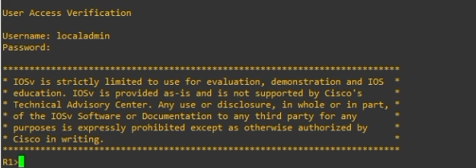

Esta evidencia muestra el acceso local al router con `localadmin`. Este usuario se dejó como respaldo del equipo para administración local.

## Validación SSH por RADIUS desde Kali

Para conectarse desde Kali fue necesario usar opciones SSH heredadas porque IOSv ofrece algoritmos antiguos.

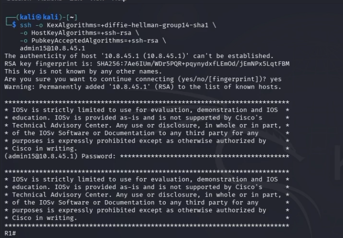

El usuario `admin15` se autenticó desde Kali hacia R1. Esta autenticación pasa por el servidor NPS, que lo autoriza con privilegio 15.

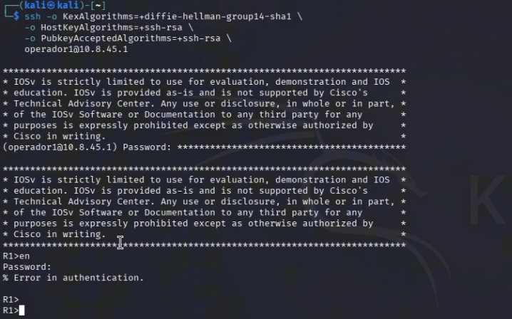

El usuario `operador1` también logra autenticarse por RADIUS, pero no entra directamente en modo privilegiado. Esto demuestra la diferencia entre los niveles de autorización.

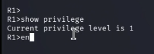

Con `show privilege` se confirma que `operador1` quedó en nivel 1.

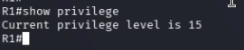

Con `show privilege` se confirma que `admin15` quedó en nivel 15.

## Verificación de servidores y sesiones AAA

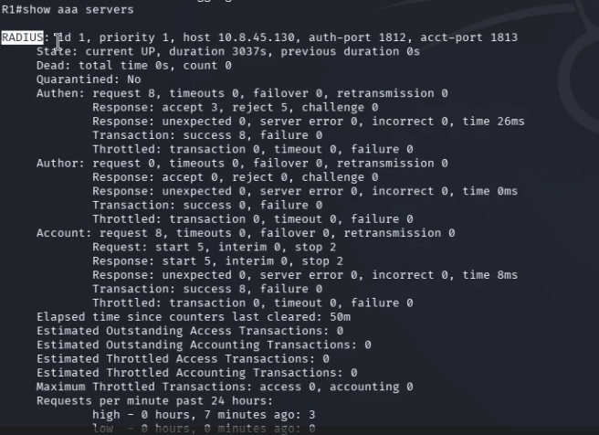

`show aaa servers` confirma que el servidor RADIUS `10.8.45.130` está activo y que existen solicitudes de autenticación y accounting procesadas.

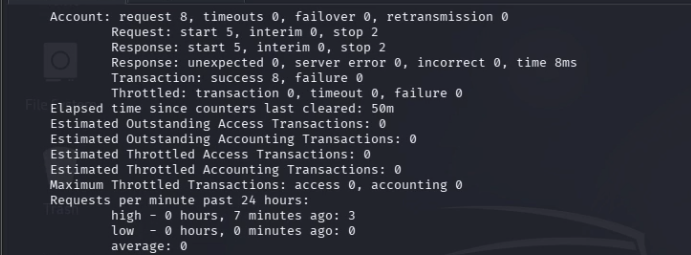

La continuación del comando muestra contadores de accounting, transacciones exitosas y solicitudes procesadas durante la práctica.

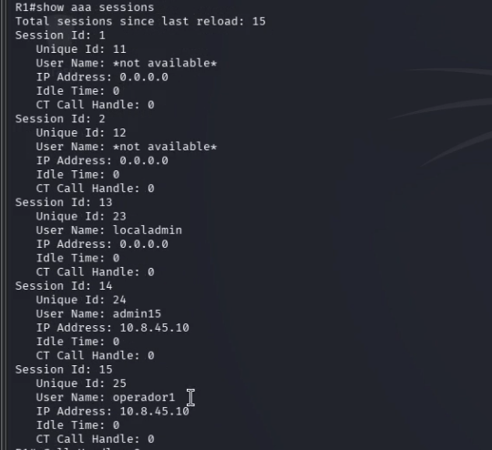

`show aaa sessions` muestra sesiones activas o recientes, incluyendo `localadmin`, `admin15` y `operador1`. Esto confirma que el router registró sesiones AAA de los usuarios probados desde Kali.

## Credenciales de laboratorio

> Estas credenciales son exclusivamente para el entorno controlado del laboratorio.

| Uso | Usuario | Contraseña |
|---|---|---|
| Kali Linux | `kali` | `kali` |
| RD Web / RADIUS privilegio 15 | `MICHAEL20250845\admin15` | `Lab20250845*` |
| RD Web / RADIUS privilegio 1 | `MICHAEL20250845\operador1` | `Lab20250845*` |
| Router usuario local | `localadmin` | `Local20250845*` |
| Router enable secret | `enable` | `Enable20250845*` |
| RADIUS shared secret | R1/NPS | `Radius20250845*` |

## Comandos útiles

### Prueba SSH con admin15

```bash
ssh -o KexAlgorithms=+diffie-hellman-group14-sha1 \
    -o HostKeyAlgorithms=+ssh-rsa \
    -o PubkeyAcceptedAlgorithms=+ssh-rsa \
    admin15@10.8.45.1
```

### Prueba SSH con operador1

```bash
ssh -o KexAlgorithms=+diffie-hellman-group14-sha1 \
    -o HostKeyAlgorithms=+ssh-rsa \
    -o PubkeyAcceptedAlgorithms=+ssh-rsa \
    operador1@10.8.45.1
```

### Verificación en R1

```cisco
show ip interface brief
show running-config | section aaa
show running-config | section radius
show running-config | section line vty
show aaa servers
show aaa sessions
show users
show privilege
```

### Debugs solicitados

```cisco
debug aaa authentication
debug aaa authorization
debug aaa accounting
debug radius
```
### Activación de debug AAA y RADIUS en R1

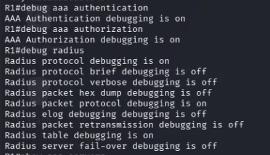

En esta evidencia se muestra la activación de los comandos de depuración solicitados para el proceso AAA y RADIUS en el router R1. Se ejecutan `debug aaa authentication`, `debug aaa authorization` y `debug radius`, permitiendo observar el comportamiento del router durante la autenticación y autorización de usuarios.

Esta captura se incluye como evidencia complementaria de los mecanismos de depuración usados durante las pruebas. Aunque algunos subtipos internos de RADIUS aparecen como `off`, el debug principal del protocolo RADIUS queda activo, junto con la depuración de autenticación y autorización AAA. Esto permite validar que R1 estaba preparado para mostrar eventos relacionados con la comunicación hacia el servidor NPS/RADIUS.

Apagar debug:

```cisco
undebug all
show debugging
```

## Conclusión

El laboratorio cumple con los requerimientos principales: página IIS personalizada, publicación por RemoteApp, acceso mediante RD Web Access clásico, acceso mediante RD Web Client HTML5, NPS como servidor RADIUS, usuarios separados por grupos de Active Directory y autenticación SSH del router por RADIUS con privilegios Cisco 15 y 1.
